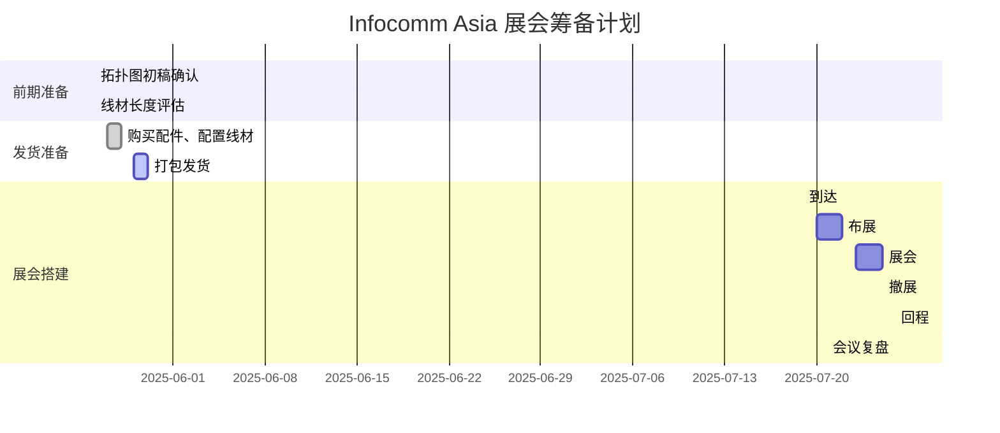

# 泰国展会 2025年7月v2

[toc]

1. 展位号：M18
2. 面积4x9米
3. 主墙需要预留60cm储藏间，也做走线用

## 1. 主体区域说明

 

| 区号  | 区域名称      | 精简方案说明                                   |
| ----- | ------------- | ---------------------------------------------- |
| 1区   | 分组教学区    | 演示小组协作与集中控制，模拟分布式课堂场景。   |
| 1区-B | 海报屏区      | 在分组教学背面，独立展示海报内容               |
| 2区   | NDP100 区     | 展示讲台控制、多媒体教学与设备联动能力。       |
| 3A区  | 录播 & IoT 区 | 结合录播与物联网应用，展示教学采集与环境控制。 |
| 3B区  | AHY500 区     | 模拟会议协作与远程控制，BYOM 应用场景。        |
| 4区   | NDP500 区     | 展示讲台控制、多媒体教学与设备联动能力。       |
| 5区   | NPS会议室区   | 模拟会议协作与远程控制，支持多设备接入。       |
| 6区   | 创意展示区    | 四屏拼接成画，增强视觉吸引力与品牌表达。       |

## 2. 拓扑图说明

### 2.1 总体

 

| 线缆类型                           | 颜色       | 颜色码    |
| ---------------------------------- | ---------- | --------- |
| **LAN / Ethernet / PoE+**          | 🟦 蓝色     | `#0074D9` |
| **HDMI (视频)**                    | 🔴 红色     | `#FF4136` |
| **USB**                            | 🟡 黄色     | `#FFDC00` |
| **RS232 / RS485**                  | 🟣 紫色     | `#B10DC9` |
| **Audio**                          | 🟢 绿色     | `#2ECC40` |
| **IR 控制线（发射器）**            | 🔘 灰色     | `#AAAAAA` |
| **Relay 控制线**                   | 🟠 橙色     | `#FF851B` |
| **电源线（DC/AC）**                | ⚫ 黑色     | `#111111` |
| **Wi-Fi / NFC / UHF / 空中IR通信** | ⚫ 黑色虚线 | ---       |

#### 2.1.1 网格与尺寸信息

 

 

- 展台总尺寸为 **9m x 4m**（9000mm x 4000mm）
- **总电源**位于左上角，**服务器区**靠近中部靠墙

#### 2.1.2 取电点位置与数量

 

### 2.2 一区(分组教学区)

  

1. **学生端**：学生（业务员）通过手机、平板等把画面通过 WP45推送至PD300。
   - 队长需要携带2个鼠标方便演示，本次不采用Touch USB方式，主要是限制于线材长度
2. **教师端**则是由NDP100的OPS段投射到TR1300上演示；NDP00的OPS 同时运行光能板与分组教学软件，需错开演示，避免冲突。

#### 🔌线材统计

1. **LAN 网络线**

   施工方预埋，位置从WP40层架网上走顶一直绕到储藏间，统计处来距离 高度4米+走顶 8米+下垂到储藏室4米+冗余量6米 = 22米

   | No.  | 长度 | 类型规格 | 用途与备注           |
   | ---- | ---- | -------- | -------------------- |
   | 1    | 22米 | Cat6     | WP45供网，施工方预埋 |
   | 2    | 22米 | Cat6     | WP45供网，施工方预埋 |

2. **HDMI 线材**

   展会高度4米，考虑到WP40是放在层板内，2米通常足够，但是工程线材需要考虑冗余量，因此按照3米统计

   | No.  | 长度 | 类型规格         | 用途             |
   | ---- | ---- | ---------------- | ---------------- |
   | 1    | 5米  | HDMI2.0, 4K@60Hz | IQMatrix ➜ PD300 |
   | 2    | 5米  | HDMI2.0, 4K@60Hz | IQMatrix ➜ PD300 |

3. **电源线&插座**

   | No.  | 长度 | 类型规格 | 用于与备注                      | 取电点 |
   | ---- | ---- | -------- | ------------------------------- | ------ |
   | 1    | 5米  | 5-6孔    | PD300 x 2 分组教学盒子 X 2 | 2      |

    

   **Power Adapter**: Model KZ1203000W, Input 100–240V~ 50/60Hz 1.0A Max, Output 12V⎓3.0A (36W Max), Indoor use only, Made in China, Certifications: CE, FCC, UKCA, RoHS

#### 2.2.1 Digital Poster-R // 320 x 1080 

 

U盘展示海报屏内容

- 诗雨设计一张使用手机投屏下发 屏精灵

##### 🔌线材统计

1. **电源线&插座**

   | No.  | 长度 | 类型规格 | 用于与备注           | 取电点 |
   | ---- | ---- | -------- | -------------------- | ------ |
   | 1    | /    | /        | Digital Poster-R供电 | 1      |

### 2.3 二区 NDP100区

  

**NDP100展区布线与功能说明**

1. 本区以 **NDP100智能讲台** 为核心，搭配一块 **75寸大屏** 与两块 **光能板**，组成标准教室主墙面。
   - 注： 现场可能只有2个PS610，一台给NDP100,另一台给NDP500；
2. 控制演示包括：
   - **空调面板**（IR控制）；
   - **壁龛灯带**（接入NDP100 External口，展方预留电源尾线）；
   - **电动幕布**（接入NDP100控制上下）。
   - 注： 本次不演示IFP的RS232控制，原因是需要从厂家拿到控制码，让开发导入，再进行测试，项目款投入产出比不高。
3. **NDP100内置OPS** 同时服务本区光能板与分组教学(教师端）展示，演示需注意错峰避免资源冲突。
   - 3根USB线：2根光能板 1根给分组教学的教师端

#### 🔌 NDP100区域线材统计

1. **LAN 网络线**

   | No.  | 长度 | 类型规格 | 用途与备注     |
   | ---- | ---- | -------- | -------------- |
   | 1    | 10米 | Cat6     | 路由器 ➜NDP100 |

2. **HDMI 线材**

   | No.  | 长度 | 类型规格         | 用途与备注                      |
   | ---- | ---- | ---------------- | ------------------------------- |
   | 1    | 8米  | HDMI2.0, 4K@60Hz | NDP100 ➜ 主屏 TR1300C（背接）   |
   | 2    | 1米  | HDMI2.0, 4K@60Hz | E4521 ➜ NDP100（展台设备）      |
   | 3    | 8米  | HDMI2.0, 4K@60Hz | NDP100 ➜ LCS810（录播系统输入） |

3. **音频线**

   | No.  | 长度 | 类型与规格                                                   | 用途与备注     |
   | ---- | ---- | ------------------------------------------------------------ | -------------- |
   | 1    | 8米  | gold silver speaker wire OFC Oxygen-Free Copper 16AWG [^1] | NDP100 ➜ PS610 |
   | 2    | 8米? | gold silver speaker wire OFC Oxygen-Free Copper 16AWG / 14AWG / 18AWG | NDP100 ➜ PS610 |

4. **USB线// 光能板用液晶的OPS** 

   | No.  | 长度                         | 类型与规格 | 用途与备注                                                   |
   | ---- | ---------------------------- | ---------- | ------------------------------------------------------------ |
   | 1    | 10米 | A-B        | NDP100的OPS ➜ IFP 用于分组教学的情况下， 教师端在IFP上触控学生端投射上来的内容 因此接线需要注意**同前同后** |
   | 2    | 3米                          | A-A        | IFP的OPS➜ 光能板 需要用到[A-A延长线](https://detail.tmall.com/item.htm?abbucket=11&detail_redpacket_pop=true&id=765249635198&ltk2=1749107901424oyv509pls6ji3nrjqjeov&ns=1&priceTId=2150458817491078857246321e1a93&query=USB%20%20A-A%20%E5%BB%B6%E9%95%BF%E5%99%A8&skuId=5265345905512&spm=a21n57.1.hoverItem.9&utparam=%7B%22aplus_abtest%22%3A%223598a4823b5c8fca6d87766ae6e17f38%22%7D&xxc=taobaoSearch) |
   | 3    | 3米                          | A-A        | IFP的的OPS➜ 光能板                                           |

5. **控制线**

   | No.  | 类型          | 长度     | 类型与规格     | 用途与备注                                 |
   | ---- | ------------- | -------- | -------------- | ------------------------------------------ |
   | 1    | IR            | 标配长度 | IR 标配        | 走CBX控制                                  |
   | 2    | Power Cable   | 10米     | 三芯电源线     | NDP100--> 演示幕布                         |
   | 3    | Relay         | 8米      | 三芯电源线     | NDP100--> 灯带 （**扁的线**）不要圆的 |
   | 4    | RS232【不接】 | 1.5 米   | 3PIN - 3PIN    | CBX-RS232控制录播                          |
   | 5    | RS232【不接】 | 8米      | 3PIN -D89-3PIN | 控制液晶;  NDP100 >  走地 > IFP            |

6. **电源线&插座**

   | No.  | 长度 | 类型与规格 | 用途与备注                                                   | 取电点 |
   | ---- | ---- | ---------- | ------------------------------------------------------------ | ------ |
   | 1    | 3米  | 6-8孔      | TR1300C x 1 MEMO2  x 1 CBX3 x 1                    | 12     |
   | 2    | 6米  | 3-4孔      | CBX2  x 1 MEMO1 x 1 空调面板 x 1                   | 12     |
   | 2    | /    | /          | 直接接入取电9供电 NDP100 x1 E4521 x 1              | 9      |
   | 3    | 3米  | 6-8孔      | Strip Light 灯带 x 1 录播主机 x 1 录播Sound Mixer x 1 拉取给10区的排插 x 2 | 10     |

### 2.4 三区

#### 2.4.1 三区A 录播区域

 

- **录播（LCS810）可作为 NDP100 的视频输入源**，通过矩阵输出至 TR1300 Pro，便于访客观看课堂实况。但受限于系统带宽，仅支持 **2K 输出**。
- 如需更清晰画质，也可选择 **直接 HDMI 连接至 TR1300 Pro**，但此方式不支持矩阵切换。
- 另一种方案是将 **NDP100 的画面作为课件信号输入 LCS810**，演示课堂录制的完整流程。

##### 🔌 LCS 线材统计

1. **LAN 网络线**

   | No.  | 长度 | 类型与规格 | 用途与备注                            |
   | ---- | ---- | ---------- | ------------------------------------- |
   | 1    | 22米 | Cat6, PoE  | CV870-T ➜ LCS810，施工方预埋，支持PoE |
   | 2    | 8米  | Cat6, PoE  | CV870-S ➜ LCS810，支持PoE             |
   | 3    | /    | /          | /                                     |
   | 4    | 5米  | Cat6       | S610➜  Sound Mixer                    |

2. HDMI 线材

   | No.  | 长度 | 类型与规格       | 用途与备注                 |
   | ---- | ---- | ---------------- | -------------------------- |
   | 1    | 12米 | HDMI2.0, 4K@60Hz | NDP100 ➜ LCS810 视频输入口 |

3. **音频线**

   | No.  | 长度 | 类型与规格                   | 用途与备注                     |
   | ---- | ---- | ---------------------------- | ------------------------------ |
   | 1    | 2米  | 3.5mm转 3.5mm **2节！** | Sound Mixer ➜ LCS810，音频输入 |

4. **USB线**

   N/A

5. 控制线

   CBX -RS232 

6. **电源线 & 插座**【取电点8】

   | No.  | 长度 | 类型与规格  | 用途与备注                       | 取电点 |
   | ---- | ---- | ----------- | -------------------------------- | ------ |
   | 1    | 5米  | 3-4 outlets | LCS810 主机供电 Sound Mixer | 8      |

#### 2.4.2 三区B AHY500 BYOM区

 

1. 这面墙是IOT的的反面，悬挂的三个产品，围绕AHY500为核心做BYOM介绍演示
2. 光能板的软件支持借用NDP500的OPS，画面投射到135 inch一体机上，注意NDP500另一个输入源E4521错开演示

##### 🔌 AHY500 线材统计

1. **LAN 网络线**

   | No.  | 长度 | 类型与规格      | 用途与备注            |
   | ---- | ---- | --------------- | --------------------- |
   | 1    | /    | Cat6 【不需要】 | AHY500 ➜ 储物间交换机 |

2. **HDMI 线材**

   | No.  | 长度 | 用途与备注          |
   | ---- | ---- | ------------------- |
   | 1    | 2米  | AHY500 ➜ SW1 显示器 |

3. **音频线**

   N/A

4. **USB线**

   | No.  | 长度 | 类型 | 用途与备注                                            |
   | ---- | ---- | ---- | ----------------------------------------------------- |
   | 1    | 5米  | A-A  | IQ Board MEMO ➜ NDP500 OPS（共享） A-A USB延长线 |

5. **控制线**

   N/A

6. **电源线 & 插座**

   | No.  | 长度        | 用途与备注                                                   | 取电点 |
   | ---- | ----------- | ------------------------------------------------------------ | ------ |
   | 1    | 3米 / 6-8孔 | AHY500 x 1 SW1 x 1 IQ Board MEMO x1 Project Screen (for NDP100) | 7      |

### 2.5 四区 NDP500区

   

**NDP500展区布线与功能说明：**

1. 本区围绕 **NDP500讲台** 展示智慧教室方案，连接 **135寸LED一体机** 和 **PS610音箱**，支持OPS与E4520信号切换演示。

   - 注1： 本方案不演示Reverse Touch功能
   - 注2：现场可能只有2个PS610，一台给NDP100,另一台给NDP500；

2. 控制类展示包括：**空调控制面板**、音量调节功能，体现设备联动控制能力。

4.  **光能板LE60P**（USB连接NDP500）用于书写演示。

   > 注：投屏演示与光能板共享OPS资源，讲解需注意错开切换。

#### 🔌 NDP500区线材统计

1. **LAN 网络线**

   | No.  | 长度 | 用途与备注                      |
   | ---- | ---- | ------------------------------- |
   | 1    | 10米 | NDP500 ➜ 储物间交换机，用于连网 |

2. **HDMI 线材**

   | No.  | 长度  | 用途与备注                          |
   | ---- | ----- | ----------------------------------- |
   | 1    | 10米  | NDP500 ➜ 135寸LED一体机，主视频输出 |
   | 2    | 1.5米 | E4520 ➜ NDP500（展台演示）          |

3. **音频线**

   | No.  | 长度 | 用途与备注                 |
   | ---- | ---- | -------------------------- |
   | 1    | 6米  | NDP500 ➜ PS610（音箱）左侧 |
   | 2    | 6米  | NDP500 ➜ PS610（音箱）右侧 |

4. **USB线**

   | No.  | 长度 | 类型 | 用途与备注                |
   | ---- | ---- | ---- | ------------------------- |
   | 1    | 5米  | A-A  | LE60P 光能板 ➜ NDP500 OPS |

5. **控制线**

   | No.  | 类型 | 长度          | 用途与备注            |
   | ---- | ---- | ------------- | --------------------- |
   | 1    | IR   | 1.5米（默认） | NDP500 ➜ 空调面板控制 |

6. **电源线 & 插座** 

   | No.  | 长度        | 用途与备注                                              | 取电点 |
   | ---- | ----------- | ------------------------------------------------------- | ------ |
   | 1    | 6米 / 3孔   | NDP500 主体供电 x 1  E4521 x 1                     | 6      |
   | 2    | 5米 / 4-6孔 | 135寸一体机  x 1 【2000+W】 CBX1 x 1 AC-Panel | 11     |

   

### 2.6 五区 NPS会议室方案区

     

本方案基于 NPS 中控主机，实现多屏投影与会议控制：

1. **输入端**支持两路 HDMI 信号（如笔电、WP50），同时连接 USB 外设（键鼠、麦克风 S350、摄像头 CV810 GEN2）；
2. 推荐输出：
   - **HDMI OUT 1(主屏）** 接至 65寸 QA1300 PRO
   - HDMI OUT 2 接 SW1 用于辅助显示；
3. Touch Panel 与 NPS 主机均需从储物间预埋线缆接入；CV810 GEN2 虽支持 PoE，但考虑网线长度限制，改为接入 NPS 的 LAN 口并使用 DC 电源供电。
4. 备用射灯可能会接入到NPS；同时也多带一个AC面板做控制演示；
5. 备注：
   - Touch Panel走PoE可以减少一个AC供电，看起来更简洁
   - CV810 GEN 2虽然支持PoE，但是排查口很多，可以考虑从NPS公网+AC供电，挂在墙壁上多接一个AC线也不会显得凌乱。

#### 🔌 NPS区线材统计

1. **LAN 网络线**

   | No.  | 长度 | 用途与备注                           |
   | ---- | ---- | ------------------------------------ |
   | 1    | 12米 | NPS ➜ 储物间交换机，用于系统联网     |
   | 2    | 15米 | Touch Panel ➜  储物间交换机 PoE |
   | 3    | 8米  | CV810 GEN2 ➜ NPS                     |

2. **HDMI 线材**

   | No.  | 长度 | 用途与备注                          |
   | ---- | ---- | ----------------------------------- |
   | 1    | 1米  | WP50 ➜ HDMI IN1                     |
   | 2    | 1米  | Laptop ➜ HDMI IN2                   |
   | 3    | 5米  | HDMI OUT1 ➜ QA1300 PRO（主屏）      |
   | 4    | 5米  | HDMI OUT2 ➜ SW1 Basic 55"（辅助屏） |

3. **音频线**

   N/A

4. **USB线**

   | No.  | 长度 | 类型   | 用途与备注             |
   | ---- | ---- | ------ | ---------------------- |
   | 1    | 1米  | A-B    | NPS ➜ Laptop           |
   | 2    | 1米  | A-B    | NPS ➜ WP50             |
   | 3    | 5米  | A-B    | CV810 GEN2 ➜ NPS       |
   | -    | N/A  | Dongle | 麦克风 S350 ➜ NPS      |
   | -    | /    | /      | Keyboard & Mouse ➜ NPS |

5. **控制线**

   | No.  | 类型               | 长度 | 用途与备注                      |
   | ---- | ------------------ | ---- | ------------------------------- |
   | 1    | RS232 带D89头 | 5米  | NPS--> CV810                    |
   | 2    | Relay              | 5米  | NPS ➜ 灯带开关/插排板等扩展演示 |

6. **电源线 & 插座**

   | No.  | 长度        | 用途与备注                                              | 取电点 |
   | ---- | ----------- | ------------------------------------------------------- | ------ |
   | 1    | 5米 / 4-6孔 | CV810 GEN2 x 1 QA1300 PRO  x 1 SW1 显示器 x 1 | 5      |
   | 2    | 3米 / 4-6孔 | NPS 主机 x1 WP50  x 1 控制灯演示备用 x 1      | 5      |

### 2.7 六区 一体机

//时序

//色差

四台一体机以花形布局组合展示，由设计师分别制作四个局部画面，通过 U盘插入各自设备独立播放，拼接出一幅完整图像。

 

1. **电源线 & 插座**

   | No.  | 长度        | 用途与备注   | 取电点 |
   | ---- | ----------- | ------------ | ------ |
   | 1    | 5米 / 5-6孔 | 屏幕取电 x 4 | 4      |

   

## 3. 项目进度

## 4. 修订记录

| Version | Status | Description                                                  | Date Modified | Modifier/Contributor |
| ------- | ------ | ------------------------------------------------------------ | ------------- | -------------------- |
| v1.0    | New    | 初稿                                                         | 2025-5-26     | Lee                  |
| v2.0    | Added  | 1. 总体区域描述概述话 2. 拆分出AHY500演示区并加以说明 3. 对各个方案的产品细节进行优化调整 4. 新增海报屏R章节描述 | 2025-5-27     | Bonnie               |

*Status:  New，Edited，Added，Deleted

## References

1.  [Plug & socket types around the world.md](../../../../Blogs/Product/Hardware/PowerSocket/Plug & socket types around the world.md) 

### 场地排查规格 //美规转接头

 

 

1. **插座（墙上的）**：
   - 插孔形状兼容多个插头制式，包括欧规（Type C/Type F）、英规（Type G）、以及中规（中国通用的多功能插座）。
   - 这是**多功能插座**，常见于东南亚国家，如泰国、马来西亚等，方便兼容不同国家的插头。
2. **插头（地上的）**：
   - 插头是**欧规（Type C 或 Type F）**，两个圆柱形插针，无接地或有接地金属片。

总结：

- 插座是**多制式兼容插座**，常见于**中国、泰国**等国家。
- 插头是**欧规插头（European plug）**。

### American Wire Gauge (AWG)

[^1]:   14AWG OFC gold silver speaker wire for amplifier to passive speaker ↩

AWG 是美国常用的电线粗细标准，**数字越小，线越粗，电流承载能力越强**。

| AWG   | 导体直径（mm） | 适合用途（音频）           | 特性说明                   |
| ----- | -------------- | -------------------------- | -------------------------- |
| 12AWG | ≈ 2.05 mm      | 大功率音响/长距离（>15米） | 非常粗，电阻低，适合远距离 |
| 14AWG | ≈ 1.63 mm      | 中高功率，5~15米距离       | 常用于家庭影院、会议室     |
| 16AWG | ≈ 1.29 mm      | 中等功率，<10米内          | 主流选择，性价比高         |
| 18AWG | ≈ 1.02 mm      | 小功率设备，短距离（<5米） | 较细，适合近距离连接       |
