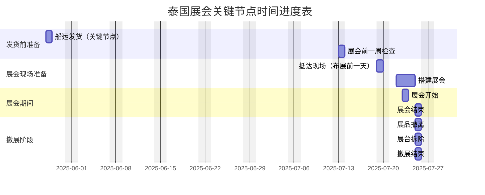

# 泰国展会 2025年7月

[toc]

# 泰国展会2025

1. 展位号：M18
2. 面积4x9米
3. 主墙需要预留60cm储藏间，也做走线用

## 1. 主体区域说明

 


| 区号 | 区域名称            | 主要展品与功能说明                                           |
| ---- | ------------------- | ------------------------------------------------------------ |
| 1区  | 分组教学区          | PD300 ×2（21.5寸屏，展示分组讨论内容）                       |
| 2区  | NDP100 区           | NDP100智能讲台 + E4520、75寸大屏、音箱等，展示标准教室方案;<br />LCS810主机、CV870摄像头(与3区录播联动) |
| 3区  | 录播 & IoT 展区     | LCS630、LCS710录播主机、CV210摄像头、S210麦克风；<br />CBX200、展示录播和IoT联动（IoT主要是与NDP100联动） |
| 4区  | NDP500 区           | NDP500 GEN2.1 + 135寸LED大屏 演示高级讲台控制<br /> CPL50门牌（与5区NPS联动） |
| 5区  | NPS（会议室方案）区 | NPS100 + QA1300PRO（65寸）、CV810 GEN2摄像头、S350拾音器，模拟会议室控制和协作场景 |
| 6区  | 广告机              | 外墙（一朵花区域）: 广告机SW1 Lite   适合走道吸引与轻交互展示<br />内墙： AHY500+C5、LE60P光能板、SW1 Lite |


## 2. 拓扑图说明


### 2.0 总体

 

```css
Legend:
🟦 LAN — Network Connection (via CAT5e/CAT6, PoE+ if applicable)
🔴 HDMI — Video Signal Transmission
🟡 USB — Data Device / Touch Signal
🟢 Audio — Audio In/Out Signal
🟣 RS232/RS485 — Serial Control Signal
🔘 IR — Infrared Signal (Remote / Learning)
🟠 Relay — Logic Trigger Control (e.g. Light / Curtain)
⚫ Power — DC or AC Power Supply
— — — Wireless Communication (Wi-Fi / NFC / IR / UHF)
```


### 2.1 一区(分组教学区)

 

1. 本区由 **NDP100 的 OPS** 提供信号，通过矩阵功能将画面推送至 **两台 PD300**，每台配一台 **WP45 接收器**。
2. OPS 同时运行光能板与分组教学软件，需错开演示，避免冲突。


### 二区 NDP100区

 

**NDP100展区布线与功能说明**

1. 本区以 **NDP100智能讲台** 为核心，搭配一块 **75寸大屏** 与两块 **光能板**，组成标准教室主墙面。
2. 控制演示包括：
   - **空调面板**（IR控制）；
   - **壁龛灯带**（接入NDP100 External口，展方预留电源尾线）；
   - **电动幕布**（接入NDP100控制上下）。

3. **NDP100内置OPS** 同时服务本区光能板与分组教学展示，演示需注意错峰使用，避免资源冲突。


### 三区 录播区域

 

- **录播（LCS810）可作为 NDP100 的视频输入源**，通过矩阵输出至 TR1300 Pro，便于访客观看课堂实况。但受限于系统带宽，仅支持 **2K 输出**。
- 如需更清晰画质，也可选择 **直接 HDMI 连接至 TR1300 Pro**，但此方式不支持矩阵切换。
- 另一种方案是将 **NDP100 的画面作为课件信号输入 LCS810**，演示课堂录制的完整流程。


### 四区 NDP500区

 

**NDP500展区布线与功能说明：**

1. 本区围绕 **NDP500讲台** 展示智慧教室方案，连接 **135寸LED一体机** 和 **PS610音箱**，支持OPS与E4520信号切换演示。

   > 注： 本方案不演示Reverse Touch功能

2. 控制类展示包括：**空调控制面板**、音量调节功能，体现设备联动控制能力。

3. **B面墙展示**涵盖两种会议场景：

   - 通过 **Dongle无线投屏** 至 AHY500 + SW1，讲解 **BYOM远程会议**；
   - 手机/平板直投 SW1，展示 **本地会议便捷性**。

4. 同墙还配置 **光能板LE60P**（USB连接NDP500）用于书写演示。

   > 注：投屏演示与光能板共享OPS资源，讲解需注意错开切换。


### 五区 NPS会议室方案区

 

本方案基于 NPS 中控主机，实现多屏投影与会议控制：

1. **输入端**支持两路 HDMI 信号（如笔电、WP50），同时连接 USB 外设（键鼠、麦克风 S350、摄像头 CV810 GEN2）；
2. 推荐输出：HDMI OUT 1 接至 65寸 QA1300 PRO，HDMI OUT 2 接 SW1 用于辅助显示；
3. Touch Panel 与 NPS 主机均需从储物间预埋线缆接入；CV810 GEN2 虽支持 PoE，但考虑网线长度限制，改为接入 NPS 的 LAN 口并使用 DC 电源供电。


- AC panel
- CV810 加RS232
- 射灯


### 六区 一体机

四台一体机以花形布局组合展示，由设计师分别制作四个局部画面，通过 U盘插入各自设备独立播放，拼接出一幅完整图像。

 


## 3. 会议纪要


### 2.0 总体

 

1. 总电位置大概在左上角（**艺娇**）

   - 该位置会关系搭配排插长度的预估

2. 服务区放在中间(**王力**)

   - 该位置会关系到网线等长度的预估

3. 存储空间两边要留门(**冰雯**)

   - 单边进出不方便
   - 宽度目前只有600

4. 总计预留11个取电点(**冰雯**)

     

   - 与承建商进一步确认(**冰雯**)

5. 网线预埋：(**冰雯**)

    

   - 从服务器区域拉出三根网线走顶一路拉到1区(**冰雯**)

6. 线槽盒预埋？：(**冰雯**)

    

   1. 【1】-【2】NDP500供网给NSP
   2. 【3】-【4】 NDP100公网给WP45

7. 前台

    

   - 压缩到1米（目前1米5）：(**冰雯**)
   - 挂钩（挂在前台侧面）：(**冰雯**/艺娇)


### 2.1 一区(分组教学区)


1. 隔断层木板最底下镂空

    

   显示屏用PD300 x2，考虑到取电和布线问题，因此：

   - 中间不能有卡板、隔离板，需要引线
   - PD300的电源适配器与长度确认

2. 网络则是从NDP100获取

   - 因此需要线槽盒预埋

3. 预埋网线3跟

     

   - 一根给录播
   - 两根给WP45


### 2.2 二区（NDP100区）


### 2.3 三区(录播 & IoT 展区)  

隔断墙B面 

  

1. 长度加长： 1290 --> 1350
   - 光能板LE60P的宽度是1290，太极限不容易安装
2. 厚度：20cm，内部中空； 
3. 连接处不封闭，留开口走线？**（没听懂）**

### 2.4 四区 (NDP500区)

  

1. LED一体机：需要嵌入75公分，是否会凸出来一点
   - 壁挂支架+产品本身总厚度是75m. 若要完全不突出，则内嵌应该多少
2. LED一体机：称重是否可以承受
   - 135kg是否包含了壁挂架（需要确认）


### 2.5 五区 (NPS会议室方案区)


  

1. 内部的层板不能封死，要供电供网


### 2.6 六区（一朵花区域)

1. 与章明确认广告机的事宜


## 4. 购买清单

1. 演示幕布（林翔，秘鲁）
2. 穿线器
3. PoE交换机（LAN口多一点）
4. 广告机2条Ｌ型品质头和适配器头的线
5. 广告机壁挂件
6. LED一体机四个边，买以下材料，避免到时候缝隙很大，包起来美观一点
7. 射灯还是带着（PLAN B)
8. 排插，转换头


## 项目进度




# Reference

1. https://chatgpt.com/c/681c4dcf-91b0-8012-9eeb-4fd35b6afbd5

## 历史记录

 

**话题： 广告机展示方案**

进展： 讨论广告机展示的必要性及调整方案

详细内容： Bonnie Liu提出客户对广告机展示有顾虑，认为数量过多且难以推动销售。廖江能建议适当调整数量，并推荐SW1 Basic系列。陈冰雯询问是否可以通过其他方式展示，如靠右摆放墙面。最终讨论集中在广告机型号选择和布局上。

> 顾虑点如下：
>
> 1. 展会样机购买很多了，一直没有卖出去，积压着。但是还要一直买，而且我们都不愿意理解他，总是希望买。[傻笑]
> 2. 他们花了一年多的时间推广熵基的广告机，走不动，其他市场可能可以，泰国很难推动广告机。如果是为了展示给其他市场的客户，广告机是否可以展后带回中国[傻笑]，要不就是免费。我明确告诉他，广告机一定是要展出的，我们没有压着他备库存，仅仅是为了展会，5台样机而已，可以捆绑我们的产品如MBX, WP45, WP40卖给学校或者会议。他们希望测试我们的CMS软件。
> 3. 然后又扯海康给他们账期，我和他说我说专注做产品，不会通过给账期和客户产生粘性。然后又扯交期，说他们一直买，我也和他们说买的产品可以帮她们赚更多钱
>
> 综上，我觉得他就是想要更多的support.
